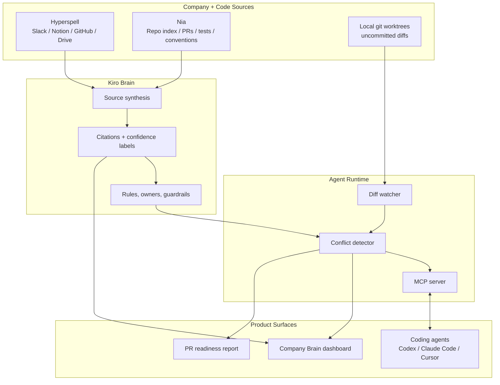

# Kiro

**Agentic memory for coding agents.**

Kiro is your company brain for coding agents - a verification layer that lets Codex, Claude Code, Cursor, and other agents understand what your company already knows before they write code. It pulls rich history from Slack channels, old Notion docs, the codebase, GitHub PRs, issues, and abandoned branches, then turns that history into grounded context every employee can access through their coding agent.

Hyperspell handles cross-source ingestion. Nia indexes the codebase. Kiro synthesizes both into one operational brain and exposes it through an MCP server. While an engineer codes, Kiro fingerprints what the agent is doing every few seconds and cross-checks the direction against the team's full memory. When the agent is heading toward a conflict - code-level or company-policy-level - Kiro pauses it and surfaces a grounded alternative with citations.

## Demo Flow

1. **Assemble** - Kiro builds a company brain from Hyperspell company memory and Nia codebase context
2. **Onboard** - A new engineer gets a calibrated task, source-backed context stream, and relevant team decisions
3. **Code** - A coding agent joins through MCP, publishes its plan, and checkpoints live work
4. **Detect** - Kiro fingerprints uncommitted diffs and catches code, schema, owner, or policy conflicts before commit
5. **Redirect** - The agent pauses, receives a grounded alternative, and continues with citations attached

## Why Kiro Exists

Every engineering team has hard-won knowledge that disappears into git history. Failed branches nobody rediscovers. Slack debates from six months ago nobody remembers. Architectural decisions that get re-litigated every time a new hire writes a feature. The information is there - it just does not reach the agent at the moment it is needed.

AI coding agents make this worse, not better. They generate code 10x faster, but they do not know what your team already learned the hard way. AI-coauthored PRs have more security vulnerabilities, and code that hits a merge conflict is dramatically more likely to have a bug.

Kiro fixes the missing layer: getting your team's accumulated knowledge into the coding agent at the moment it is writing. Before the merge conflict. Before the second new hire repeats the first one's mistake. Before the agent ships an architecture the team already rejected.

## Architecture

| Layer | Stack | Role |
| --- | --- | --- |
| **Company Memory** | Hyperspell | Ingests Slack, Notion, GitHub, Drive, CRM, meeting, and decision history |
| **Codebase Index** | Nia | Indexes repositories, open PRs, source files, tests, and code conventions |
| **Brain App** | Next.js / React / Convex / Tailwind | Demo dashboard with brain assembly, context stream, pixel office, guardrails, and PR readiness |
| **Coordinator** | Fastify / SQLite / Chokidar / Zod | Watches worktrees, fingerprints diffs, stores sessions, and manages conflict lifecycle |
| **MCP Server** | Model Context Protocol | Exposes Kiro tools to Codex, Claude Code, Cursor, and other coding agents |
| **Monitor** | Rust / Git diff analysis | Fast local blast-radius monitor for dirty worktrees and risky surfaces |
| **Evals** | Vitest fixture harness | Measures recall, false-positive rate, and latency for conflict detection |



## How Agent Guardrails Work

Kiro continuously converts live engineering work into a compact, comparable fingerprint:

| Step | What Happens | Output |
| --- | --- | --- |
| **Join** | A coding agent calls `kiro_join` from the current repo/worktree | Session id, worktree id, MCP connection |
| **Plan** | The agent calls `kiro_plan` before meaningful edits | Task intent and active ownership context |
| **Fingerprint** | Kiro scans dirty git state and changed files | Diff hash, touched files, symbols, contract surfaces |
| **Cross-check** | Kiro compares the fingerprint against company memory and other active sessions | Code conflicts, policy conflicts, owner-sensitive paths |
| **Pause** | Medium/high risk returns a pause directive | Grounded recommendation, citations, and next action |

The key distinction is timing. Kiro does not wait for a PR review or merge conflict. It checks the agent's direction while the work is still cheap to redirect.

## MCP Tools

```text
kiro_join                     register this coding session with Kiro
kiro_plan                     publish intended work before edits begin
kiro_checkpoint               refresh risk state after meaningful edit batches
kiro_fetch_intervention       fetch queued dashboard or owner guidance
kiro_wait_for_direction       pause until a user-approved direction is available
kiro_record_decision          record selected conflict resolution or ownership split
kiro_acknowledge              mark an intervention as received
```

## Key Endpoints

```text
GET  /api/brain                      company-brain synthesis packet
GET  /health                         coordinator status + MCP URL
GET  /api/worktrees                  tracked local worktrees
GET  /api/fingerprints               latest diff fingerprints
GET  /api/conflicts                  live conflict list
GET  /api/events/stream              websocket event stream
POST /api/analyze                    force a watcher scan
POST /mcp                            MCP transport endpoint
```

## Quickstart

```bash
# Install dependencies
pnpm install

# Run the Company Brain demo app on http://localhost:3000
cp apps/company-brain/.env.local.example apps/company-brain/.env.local
pnpm dev

# In another terminal, run the coordination dashboard on http://localhost:3748
pnpm dashboard:dev
```

To run the full local agent runtime:

```bash
pnpm build
pnpm kiro -- --yes
```

The CLI prints the local coordinator URL, dashboard URL, MCP endpoint, bearer token, and Codex MCP setup command.

## Environment

The demo app works in fixture mode without live provider keys:

```bash
KIRO_DEMO_MODE=fixture
```

For live or hybrid mode, configure:

```text
NEXT_PUBLIC_CONVEX_URL
CONVEX_DEPLOY_KEY
NIA_API_KEY
NIA_BASE_URL
NIA_REPOSITORIES
NIA_DATA_SOURCES
HYPERSPELL_API_KEY
HYPERSPELL_USER_ID
HYPERSPELL_BASE_URL
ANTHROPIC_API_KEY
```

## Team

Built for the **Nozomio Hackathon Company Brain track**.
