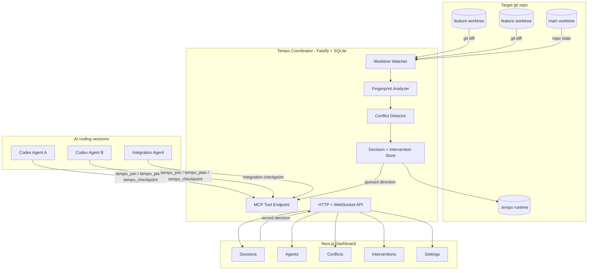

# Tempo

**Local-first coordination for parallel AI coding sessions**

Tempo is a local coordination layer for teams running multiple AI coding agents
against the same git repository. It watches live worktree diffs, fingerprints the
contract surfaces being changed, detects risky overlap before commit or merge,
and gives the user a human-controlled way to send advisory direction back to
Codex through MCP.

The target workflow is intentionally small:

```bash
cd /path/to/any-git-repo
tempo
```

The current repository is a local alpha. Codex is the first supported agent,
Tempo stays advisory rather than autonomous, and the watcher remains the source
of truth even when an agent has not joined through MCP.

## Demo Flow

1. **Start** - Run Tempo from a git repo to create repo-local runtime state,
   launch the coordinator, and open the dashboard.
2. **Join** - Each Codex session calls `tempo_join`, records a plan with
   `tempo_plan`, and checkpoints after meaningful edit batches.
3. **Watch** - The coordinator discovers worktrees, watches changed files,
   normalizes git diffs, extracts contract surfaces, and stores fingerprints in
   the local `.tempo/` database.
4. **Detect** - Tempo compares active fingerprints across worktrees and classifies
   overlaps as no issue, a coordination notice, or a blocking conflict.
5. **Decide** - The dashboard or agent chat presents the same choices; the first
   user-approved decision locks the conflict and queues per-agent directions.
6. **Adapt** - Owner agents publish the final contract shape, adapter agents wait
   or revise around that shape, and integration agents converge completed work.

## Architecture

| Layer | Stack | Role |
| --- | --- | --- |
| **CLI** | Node.js - TypeScript - pnpm workspace | Prepares `.tempo/`, loads repo-local env, starts the coordinator, launches the dashboard, and prints Codex MCP setup details. |
| **Coordinator** | Fastify - SQLite - Drizzle - Chokidar - MCP SDK | Owns the local runtime API, worktree watcher, fingerprint store, conflict lifecycle, intervention delivery, and MCP tool handlers. |
| **Analyzer** | Git diff normalization - AST-lite extractors - OpenAI optional enrichment | Turns live changes into bounded fingerprints with touched files, symbols, contract surfaces, semantic summaries, and risk evidence. |
| **Dashboard** | Next.js - React - lucide-react - @xyflow/react | Operator console for sessions, agents, conflicts, interventions, evals, and local settings. |
| **Shared Schemas** | Zod - TypeScript | Defines repo, worktree, session, fingerprint, conflict, advisory, intervention, decision, and publication contracts. |
| **Evals** | Vitest fixtures - coordinator conflict engine | Measures conflict detection recall, false-positive rate, and latency on synthetic multi-agent fixtures. |



## How Coordination Works

Tempo treats coordination as a local evidence pipeline. It does not merge code,
overwrite worktrees, or decide ownership on its own. It detects risk, gives the
user a compact decision surface, and records the resulting directions so agents
can adapt their own plans.

| Step | What Tempo Does | Why It Matters |
| --- | --- | --- |
| **Join** | `tempo_join` maps an agent session to the current cwd/worktree. | The dashboard can attribute plans, checkpoints, and queued directions to a specific agent. |
| **Plan** | `tempo_plan` records the intended work before meaningful edits. | Peer agents and the dashboard can distinguish intended overlap from accidental drift. |
| **Fingerprint** | The watcher scans dirty worktrees, hashes scoped diffs, extracts files/symbols/surfaces, and stores no raw diffs by default. | Conflict detection has enough structure to reason about contracts without persisting full code changes. |
| **Classify** | Local heuristics and optional OpenAI classification sort overlap into `no_issue`, `coordination_notice`, or `blocking_conflict`. | Compatible additive work can continue, while destructive or ambiguous shared-contract edits pause for direction. |
| **Decide** | Dashboard buttons and agent-chat choices call the same decision path. | The first approved choice wins, preventing dueling directions across control surfaces. |
| **Intervene** | Tempo queues role-specific directions such as `contract_owner`, `adapter`, `pause_only`, or `compatibility_owner`. | Each agent gets a complementary plan instead of a copied generic instruction. |
| **Publish** | Owners can checkpoint a final contract shape with `publishContract`. | Adapters can wait for and preserve the owner-approved schema/type/API shape. |

## MCP Tools

Codex sessions interact with Tempo through the local MCP endpoint printed by the
CLI. The repo's `AGENTS.md` block requires agents to join at session start, plan
before edits, checkpoint after edit batches, and pause on medium/high risk.

| Tool | Purpose |
| --- | --- |
| `tempo_join` | Register the current agent session, cwd, agent kind, display name, and coordination role. |
| `tempo_plan` | Record the agent's intended work before meaningful edits. |
| `tempo_checkpoint` | Return current risk, notifications, conflict choices, decisions, publications, and queued directions. |
| `tempo_fetch_intervention` | Compatibility path for fetching user-approved queued directions. |
| `tempo_wait_for_direction` | Wait briefly for dashboard or chat direction when a conflict needs user input. |
| `tempo_record_decision` | Record a user-approved conflict choice and queue complementary directions. |
| `tempo_acknowledge_intervention` | Mark a fetched direction as acknowledged after the agent presents its plan. |

## Key Endpoints

```text
GET  /health                         -> coordinator health, repo root, DB state, OpenAI state
GET  /api/repo                       -> tracked repository metadata
GET  /api/worktrees                  -> live git worktree topology
GET  /api/events                     -> recent runtime events
GET  /api/events/stream              -> WebSocket event stream
GET  /api/fingerprints               -> active worktree fingerprints
GET  /api/conflicts                  -> live conflicts and coordination notices
GET  /api/agents                     -> joined agent sessions and checkpoint freshness
GET  /api/interventions              -> queued/fetched/acknowledged directions
GET  /api/decisions                  -> active conflict decisions
GET  /api/advisories                 -> generated decision options
GET  /api/contract-publications      -> owner-published contract shapes
GET  /api/export/events.jsonl        -> event audit export
GET  /api/export/conflicts.jsonl     -> conflict audit export
GET  /api/settings                   -> OpenAI and Codex MCP setup state

POST /api/analyze                    -> force a watcher scan
POST /api/conflicts/:id/advisory     -> regenerate advisory options
POST /api/interventions              -> queue edited user direction
POST /api/decisions                  -> record a dashboard/user decision
POST /api/conflicts/:id/status       -> update conflict lifecycle status

POST /api/mcp/join                   -> HTTP wrapper for tempo_join
POST /api/mcp/plan                   -> HTTP wrapper for tempo_plan
POST /api/mcp/checkpoint             -> HTTP wrapper for tempo_checkpoint
POST /api/mcp/fetch-intervention     -> HTTP wrapper for tempo_fetch_intervention
POST /api/mcp/wait-for-direction     -> HTTP wrapper for tempo_wait_for_direction
POST /api/mcp/record-decision        -> HTTP wrapper for tempo_record_decision
POST /api/mcp/acknowledge-intervention -> HTTP wrapper for tempo_acknowledge_intervention
POST /mcp                            -> Streamable HTTP MCP endpoint
```

Mutation endpoints require the local bearer token generated in
`.tempo/runtime.json`.

## Quickstart

```bash
# Install workspace dependencies
pnpm install

# Verify the monorepo
pnpm typecheck
pnpm test
pnpm build

# Start Tempo from this checkout during development
node packages/cli/dist/index.js
```

For a target repository, run the built CLI from inside that repo:

```bash
cd /path/to/your/git-repo
tempo
```

On first run, Tempo prepares local runtime state:

```text
.tempo/runtime.json   -> coordinator/dashboard URLs, token, DB path
.tempo/tempo.sqlite   -> local coordinator state
.tempo/.env           -> optional repo-local OpenAI settings
AGENTS.md             -> optional Tempo coordination instructions
.gitignore            -> optional .tempo/ ignore entry
```

The CLI prints the Codex MCP setup command:

```bash
codex mcp add tempo --url http://127.0.0.1:3747/mcp --bearer-token-env-var TEMPO_LOCAL_TOKEN
export TEMPO_LOCAL_TOKEN=<token from .tempo/runtime.json>
```

## Required Environment

Tempo can run with heuristic-only analysis. OpenAI is optional and enables richer
fingerprint summaries and compatibility classification.

Repo-local env vars are loaded from the target repo's `.tempo/.env` file when
`tempo` starts:

```bash
OPENAI_API_KEY=your_key_here
OPENAI_MODEL=gpt-5.4-mini
```

Shell environment variables win if already set. Keep `.tempo/` out of git; it is
runtime state, not project source.

## Development Commands

```bash
pnpm install          # install workspace dependencies
pnpm typecheck        # TypeScript project references
pnpm lint             # ESLint across the repo
pnpm test             # Vitest test suite
pnpm build            # build all packages/apps
pnpm dev              # dashboard dev server
```

Package-specific commands:

```bash
pnpm --filter tempo-ai build
pnpm --filter @tempo/coordinator test
pnpm --filter @tempo/dashboard typecheck
pnpm --filter @tempo/shared build
pnpm --filter @tempo/evals test
```

## Privacy Model

Tempo stores local coordination data under the target repo's `.tempo/`
directory. It persists fingerprints, risk verdicts, evidence, decisions,
interventions, contract publications, and runtime events. Raw diffs are not
persisted by default.

When `OPENAI_API_KEY` is configured, Tempo sends bounded changed hunks plus local
index context for classification and semantic summaries. The resulting
structured output is validated and cached by diff hash; the raw diff payload is
not written to SQLite.

## Current Local Alpha Scope

- Thin `tempo` CLI with repo-local runtime setup.
- Fastify coordinator with SQLite persistence and token-protected mutations.
- Git worktree discovery, dirty-state tracking, and ignored-path watcher.
- AST-lite surface extraction for TS/JS, Python, Java-like files, and generic paths.
- Heuristic fingerprinting with optional OpenAI-backed enrichment.
- Conflict detection across live fingerprints and shared contract surfaces.
- Advisory choices, first-choice-wins decisions, and queued per-agent directions.
- Codex MCP tools for join, plan, checkpoint, fetch, wait, record, and acknowledge.
- Next.js dashboard pages for Sessions, Agents, Conflicts, Interventions, Evals,
  and Settings.
- Fixture eval runner for recall, false-positive rate, and latency checks.

## Showcase Demo

See [docs/showcase-demo.md](docs/showcase-demo.md) for the rehearsable two-agent
demo. The scenario creates competing edits to the same Task contract, lets Tempo
detect the conflict, records a split-ownership decision, has the owner publish a
final contract shape, and has the adapter revise around that shape before final
integration.

## Team

Built by **Tempo contributors** for local, human-controlled AI coding
coordination.

## License

MIT. See [LICENSE](LICENSE).
